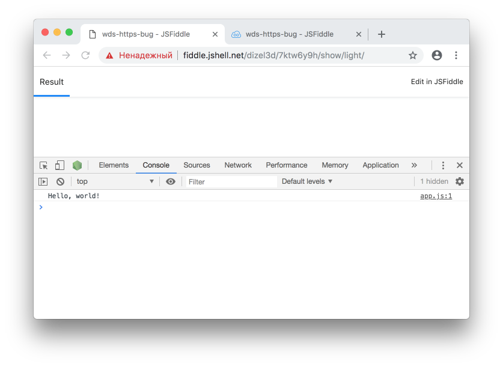
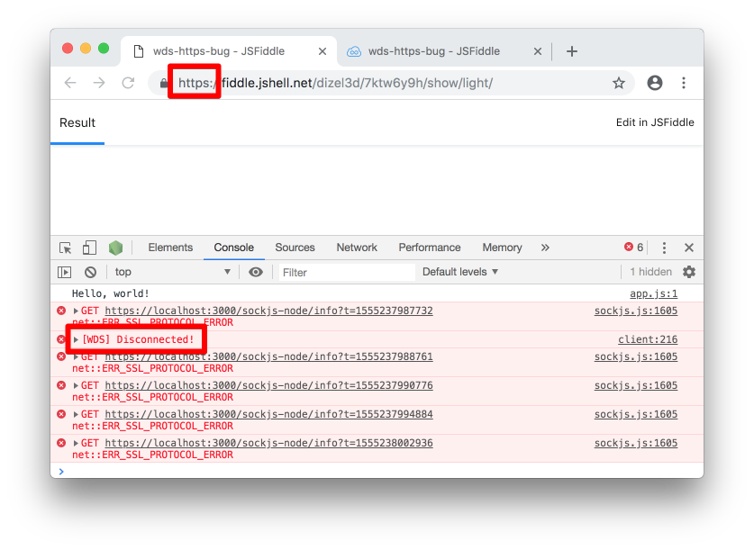

Steps to reproduce [webpack-dev-server bug #1193](https://github.com/webpack/webpack-dev-server/issues/1193):

1. Install and start webpack-dev-server (WDS):
```bash
npm install
npm start
```

Now a webpack entry with WDS client script inside is situated on http://localhost:3000/main.js

2. Go to [HTTP](http://fiddle.jshell.net/dizel3d/7ktw6y9h/show/light/) page, containing
```html
<script src="http://localhost:3000/main.js"></script>
```

As you can see, WDS client successfully connected to WDS server.



3. Go to the page via [HTTPS](https://fiddle.jshell.net/dizel3d/7ktw6y9h/show/light/).

WDS client cannot connect to WDS server.


The reason is that WDS client tries to connect to non-existent endpoint `https://localhost:3000/sockjs-node`.
But it should connect to `http://localhost:3000/sockjs-node` (The difference is in protocol.)
